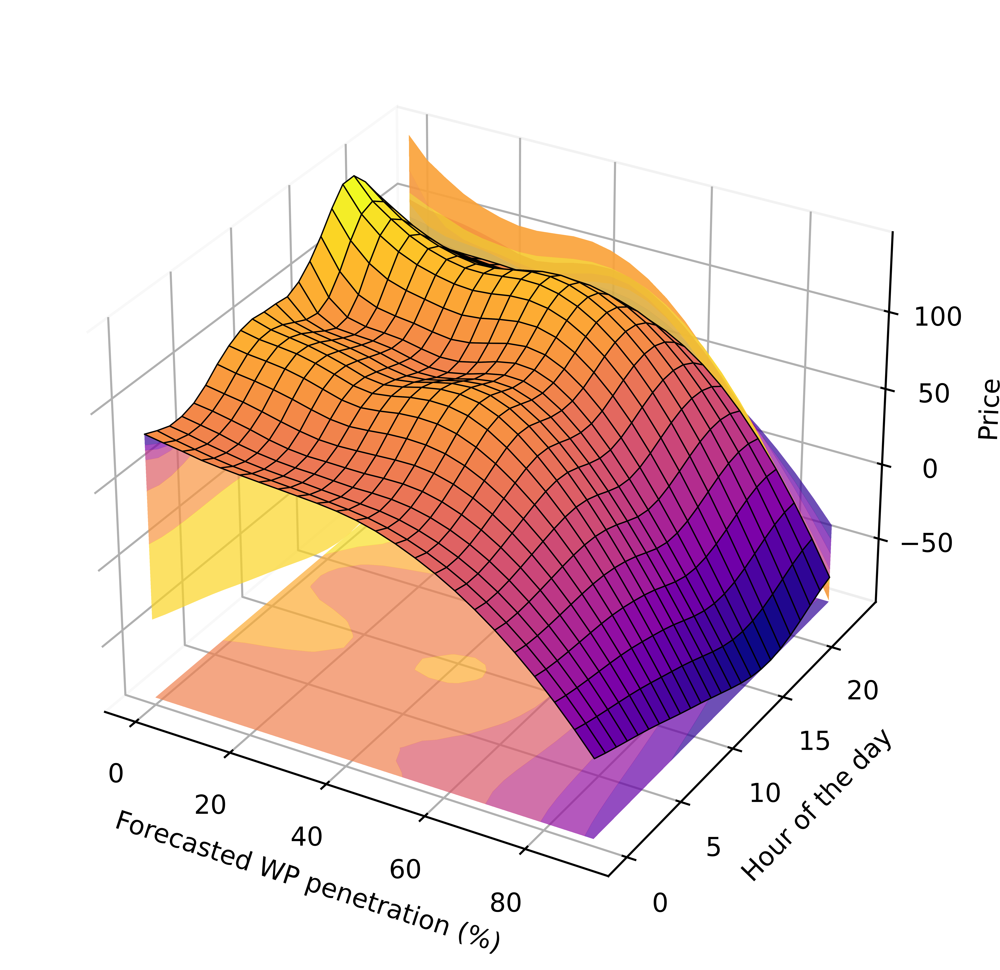

<!-- Cover Image -->

  

<!-- Title and Subtitle -->
<h1 align="center">Causality in Electricity Markets</h1>
<h3 align="center">An In-Depth Exploration of Causal Inference Techniques and Their Applications in the Energy Sector</h3>

<!-- Author Information -->

  <strong>By <a href="https://sites.google.com/view/dcacciarelli">Davide Cacciarelli</a> and <a href="https://pierrepinson.com/">Pierre Pinson</a></strong>

  <em>Imperial College London</em>

<!-- University Logo -->

<!-- Brief Introduction -->

  <em>Welcome to "Causality in Electricity Markets." This book provides a comprehensive tutorial on causal inference methodologies, explaining key concepts and showcasing potential applications within the electricity market sector. Whether you are a researcher, student, or professional, this book aims to equip you with the knowledge and tools to analyze and understand causal relationships in energy systems.</em>

